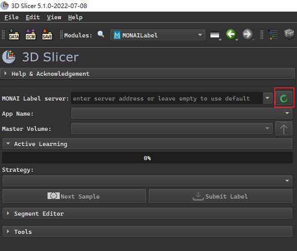
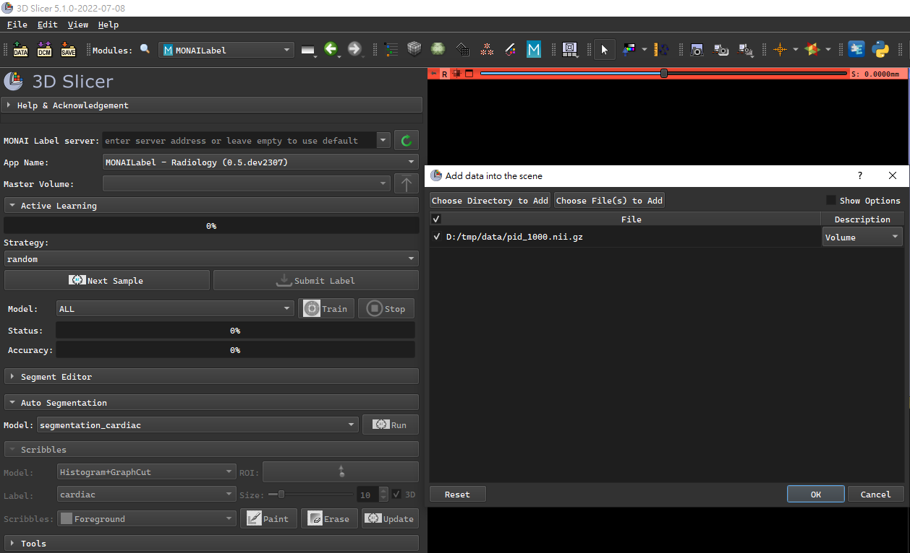
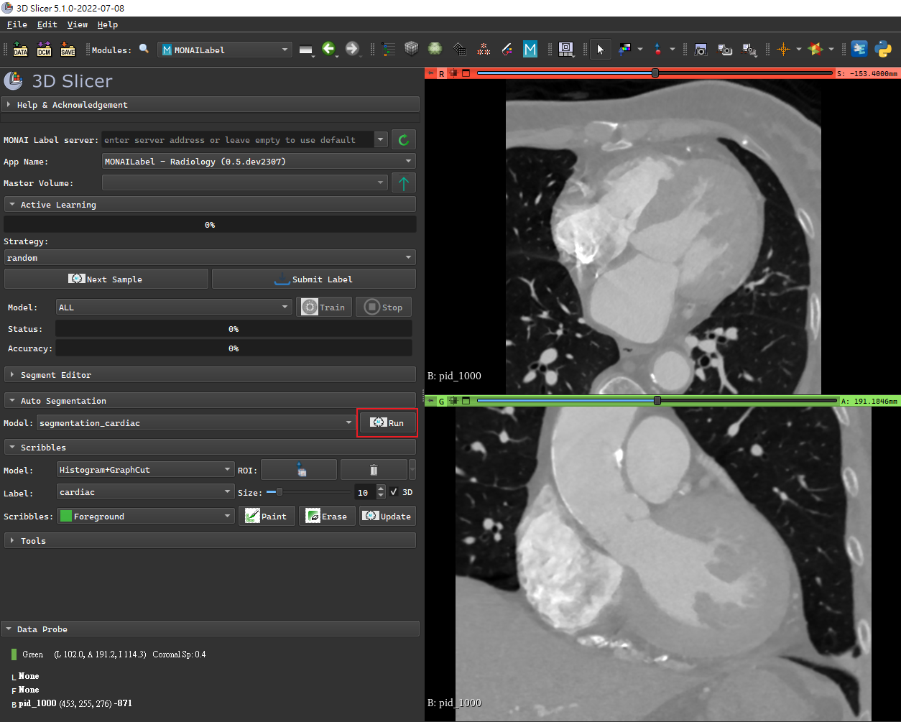

# CardiacLab
## Requirements
*  3D Slicer version 5.0 or later.
*  3D Slicer MONAI Label Plugin. (install step [here](https://docs.monai.io/projects/label/en/latest/quickstart.html#install-monai-label-plugin-in-3d-slicer))
* python 3.9
## Install
```shell
pip install -r requirements.txt
```

## Run Server
### By cmd
```shell
monailabel start_server --app radiology --studies "D:\tmp\data" --conf models segmentation_cardiac --conf network unetcnx_x0 --conf --download_ckp_id <ID>
```
* `--app `: type of app.
* `--studies`: input data dir.
* `--conf models`: type of service.
* `--conf network`: type of network.
* `--conf --download_ckp_id`: download model checkpoint file from google drive.
### By script
* set config to `run/config.toml`.
```shell
[segmentation_cardiac]
app = "radiology"
studies = "D:\\tmp\\data"
models = "segmentation_cardiac"
network = "unetcnx_x0"
download_ckp_id = "<ID>"
```
* run `run/segmentation.py`.
```shell
python run/segmentation.py
```
## Run Segmentation
*  connect server



* upload data



* run



* done

