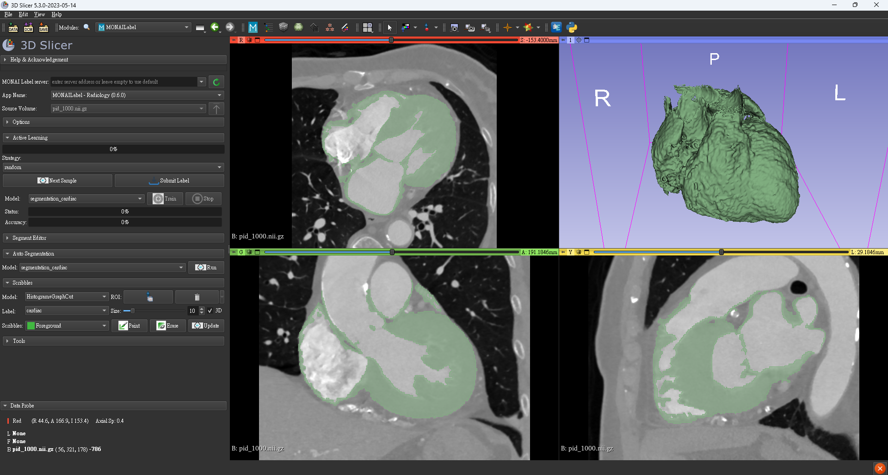

# CardiacLab


https://github.com/conflick0/CardiacLab/assets/39295341/f8a19096-56c2-484d-bcf7-e9e18abac0ca


## Requirements
* miniconda (download [here](https://docs.conda.io/en/latest/miniconda.html))
* 3D Slicer version 5.0 or later.
* 3D Slicer MONAI Label Plugin. (install step [here](https://docs.monai.io/projects/label/en/latest/quickstart.html#install-monai-label-plugin-in-3d-slicer))
* python 3.9
## Install
```shell
conda create --name CardiacLab python=3.9 -y
```
```shell
pip install torch==1.12.1+cu113 torchvision==0.13.1+cu113 torchaudio==0.12.1 --extra-index-url https://download.pytorch.org/whl/cu113
```
```shell
pip install -r requirements.txt
```
## Run Server
### By cmd
```shell
monailabel start_server \
--app radiology \
--studies "D:\tmp\data" \
--conf models segmentation_cardiac \
--conf network unetcnx_a1 \
--conf --download_ckp_id <ID> \
--conf --target_spacing "0.7, 0.7, 1.0" \
--conf --spatial_size "128, 128, 128"\
--conf --intensity "-42, 423"
```
* `--app `: type of app.
* `--studies`: input data dir.
* `--conf models`: type of service.
* `--conf network`: type of network.
* `--conf --download_ckp_id`: download model checkpoint file from google drive.
* `--conf --target_spacing`: target spacing.
* `--conf --spatial_size`: spatial size (ROI).
* `--conf --intensity`: intensity.
### By script
* set config to `run/config.toml`.
```shell
model = 'unetcnx_a1'

[segmentation_cardiac.unetcnx_a1]
app = "radiology"
studies = "D:\\tmp\\data"
models = "segmentation_cardiac"
network = "unetcnx_a1"
download_ckp_id = "<ID>"
target_spacing = "0.7, 0.7, 1.0"
spatial_size = "128, 128, 128"
intensity = "-42, 423"
```
* run `run/segmentation.py`.
```shell
python run/segmentation.py
```
## Run Segmentation
*  connect server


* upload data


* run


* done


